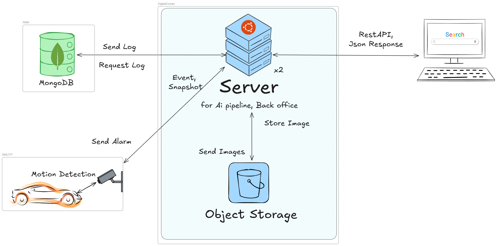
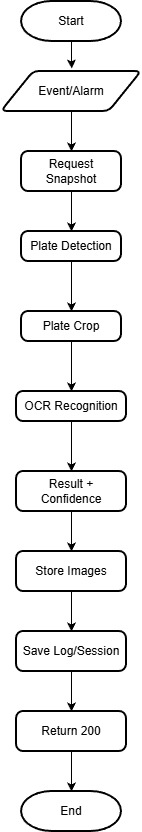

# LPR FastAPI

Automatic License Plate Recognition (ALPR) service that is part of the **Centralized Intelligent LPR** system.
It receives alarm events from Hikvision cameras → fetches a snapshot from the camera → runs two YOLOv12 models (plate detection + character recognition) → resolves vehicle entry/exit sessions atomically → logs to MongoDB Atlas and uploads images to DigitalOcean Spaces (S3-compatible).

All plate detection and OCR intelligence runs centrally on this service — cameras themselves don't need any built-in LPR/OCR capability. Any camera that can raise a basic **motion detection (VMD)** alarm and expose a snapshot API is enough; the server does the rest. This lets the system onboard a large, heterogeneous fleet of cameras across many sites/locations, each just registered in the `cameras` collection with its `organization` and `direction` (IN/OUT).

## System Architecture



The service runs on DigitalOcean (server + Object Storage) and talks to MongoDB Atlas for logs/sessions. Cameras only need motion detection and only ever *send* alarms/snapshots in — they never need to reach MongoDB or Spaces directly. Downstream clients (back office / other systems) consume results over REST API (JSON).

## Pipeline Overview

<p align="center">
  
</p>

```
Hikvision Camera
      │  (VMD alarm webhook, multipart/form-data: MoveDetection.xml)
      ▼
POST /api/v1/ocr-service/hik/alarm
      │  parse XML → per-IP cooldown/dedup check → fetch snapshot via ISAPI (Digest Auth)
      ▼
HikSnapshotService.snap_and_process()
      │  base64-encode image
      ▼
OCRService.predict()                     (runs in a threadpool, off the event loop)
      │  1) decode base64 → 2) preprocess (cv2)
      │  3) YOLOv12 plate detection model  → crop plate
      │  4) YOLOv12 character recognition model → detect characters/digits
      │  5) group by line (y-axis) → sort left-to-right (x-axis) → decode into plate number + province
      ▼
readStatus: complete | no_text | short_text | no_plate
      │
      ├─ mapCamId → resolve organization + direction (IN/OUT) from the `cameras` collection
      ├─ get_UID_by_organize → resolve the organization's subId from the `users` collection
      │
      ├─ check lock (lockedUntil) and MIN_DURATION_SEC to debounce duplicate/flickering events
      │
      ├─ DOService: upload the original + cropped plate images to DigitalOcean Spaces (parallel, S3 API)
      ├─ OcrMongoService.log_ocr(): insert a log into the `services_logs` collection
      └─ OcrMongoService.resolve_session_from_log(): atomic upsert/close session
             in the `vehicle_sessions` collection (see Race Condition Handling below)
```

There are also `/predict` and `/ml-check` endpoints for testing the OCR pipeline directly with a base64 image (without going through the camera webhook).

## Features

- **Camera-agnostic intelligence**: works with plain motion-detection cameras (no on-camera OCR/AI needed) — the camera only needs to fire a VMD alarm and expose a snapshot API; all plate detection/recognition happens server-side
- **Multi-camera, multi-site**: supports many cameras across multiple organizations/locations concurrently, each mapped to an `organization` + `direction` (IN/OUT) via the `cameras` collection, with per-camera (per-IP) cooldown/locking so events from different cameras never interfere with each other
- **Hikvision alarm webhook** with per-camera cooldowns (`alarm_cooldown_sec` for alarms, `cooldown_sec` for snapshots) to reduce duplicate events and camera load
- **2-stage YOLOv12 inference**: a detection model locates the plate, a recognition model reads the characters/province
- **Atomic entry/exit session resolution** via MongoDB `find_one_and_update` (upsert) to avoid race conditions when multiple events arrive concurrently
- **Object storage**: uploads original and cropped plate images to DigitalOcean Spaces (S3-compatible, via `aioboto3`)
- **Background job**: `APScheduler` periodically closes stale (ABANDONED) sessions based on `JOB_CHECK_SESSION_INTERVAL`
- **Structured error handling**: dedicated exceptions — `BusinessLogicError`, `MongoLogError`, `StorageServiceError`, `OCRServiceError` — with centralized handlers

## Tech Stack

| Layer | Technology |
|---|---|
| Language / Package manager | Python 3.11, [uv](https://github.com/astral-sh/uv) |
| Web framework | FastAPI + Uvicorn |
| ML inference | Ultralytics YOLOv12 (`ultralytics`), OpenCV (headless), PyTorch (CPU build) |
| Database | MongoDB Atlas + [Beanie](https://github.com/roman-right/beanie) (ODM on top of Motor) |
| Object storage | DigitalOcean Spaces (S3-compatible) via `aioboto3` |
| Scheduler | APScheduler (AsyncIO) |
| Container | Docker / docker-compose |

## Project Structure

```
app/
├── core/            # config (pydantic-settings), logging, custom exceptions/handlers
├── db/              # MongoDB/Beanie initialization
├── models/          # Beanie Documents: cameras, ocr_log, user_org, vehicle_session
├── schemas/         # Pydantic request/response schemas
├── routers/         # ocr.py -> /hik/alarm, /predict, /base64-to-img, /ml-check
├── services/
│   ├── ocr_camera.py          # Hikvision snapshot fetch + alarm pipeline
│   ├── ocr_service.py         # YOLO detection + recognition pipeline
│   ├── ocr_labelMapping.py    # class id -> character/province mapping
│   ├── ocr_mongo_service.py   # camera/org lookup, log & session persistence
│   ├── ocr_session_services.py# closes sessions left OPEN too long (ABANDONED)
│   └── do_space.py            # uploads images to DigitalOcean Spaces
└── main.py          # FastAPI app, lifespan (http client, scheduler, hik service)
model/yolo/           # model weight files (.pt) — mounted into the container read-only
```

## Getting Started

### Prerequisites

- Python 3.11+
- [uv](https://docs.astral.sh/uv/) installed
- A MongoDB Atlas connection string
- DigitalOcean Spaces (key/secret/bucket)
- YOLO weight files (`.pt`) for plate detection and character recognition placed in `model/yolo/`

### 1. Install dependencies

```bash
uv sync
```

### 2. Configure environment variables

Copy `.env.example` to `.env` and fill in the required values:

```bash
cp .env.example .env
```

| Variable | Description |
|---|---|
| `MONGO_URL`, `MONGO_DB_NAME` | MongoDB Atlas connection string / database name |
| `DO_SPACES_KEY`, `DO_SPACES_SECRET`, `DO_SPACES_REGION`, `DO_SPACES_ENDPOINT`, `DO_SPACES_BUCKET` | DigitalOcean Spaces credentials |
| `ORI_IMG_LOG_PATH_PREFIX`, `PRO_IMG_LOG_PATH_PREFIX`, `ISSUE_LOG_PATH_PREFIX` | Spaces path prefixes (`subId` placeholder is replaced with the org id resolved from Mongo) |
| `PLATE_MODEL_PATH`, `OCR_MODEL_PATH`, `PLATE_MODEL_NAME`, `OCR_MODEL_NAME` | paths/names of the two YOLO weight files |
| `YOLO_PLATE_CONF`, `YOLO_OCR_CONF`, `YOLO_IMGSZ` | confidence thresholds and image size for inference |
| `HIK_CAMERA_USER`, `HIK_CAMERA_PASSWORD` | credentials for fetching camera snapshots (Digest Auth) |
| `SESSION_TIMEOUT_MINUTES`, `JOB_CHECK_SESSION_INTERVAL` | timeout and interval for the stale-session cleanup job |
| `MIN_DURATION_SEC`, `T_CONFLICT_SEC`, `T_CLOSE_SEC` | debounce durations / session lock windows |
| `cooldown_sec`, `alarm_cooldown_sec` | per-camera snapshot / alarm cooldowns |

### 3. Run the server (dev)

```bash
uv run uvicorn app.main:app --reload
```

Health check: `GET /health`

### 4. Run with Docker

```bash
docker compose up --build
```

`docker-compose.yml` mounts `./model` into the container at `/app/model` (read-only) and exposes port `80 -> 8000`.

## API Endpoints

Base path: `{API_VERSION}` (default `/api/v1`) + `/ocr-service`

| Method | Path | Description |
|---|---|---|
| `POST` | `/hik/alarm` | Webhook that receives VMD alarms from a Hikvision camera (multipart form + `MoveDetection.xml`) and fires the snapshot + OCR pipeline fire-and-forget |
| `POST` | `/predict` | Exercises the full pipeline with a base64 image (`camId` + `imgBase64`), including S3 upload and log/session persistence |
| `POST` | `/base64-to-img` | Tests base64 decoding only |
| `POST` | `/ml-check` | Runs YOLO detection + recognition only, without writing to DB/Storage |
| `GET` | `/health` | Health check |

## Race Condition Handling (Vehicle Session)

Each vehicle's entry/exit is resolved into a session (`vehicle_sessions` collection) using atomic MongoDB operations instead of read-then-write, to avoid races from duplicate or concurrent events across cameras.

A session's `status` is always one of:

| Status | Meaning | Set when |
|---|---|---|
| `OPEN` | Vehicle has entered and has not exited yet | An `IN` event creates the session (or refreshes `lastSeenAt` if one is already open) |
| `CLOSED` | Vehicle entered then exited normally; `durationSec` is calculated | An `OUT` event finds a matching `OPEN` session and closes it |
| `CONFLICT` | An `OUT` event arrived with no matching `OPEN` session (e.g. duplicate exit, missed/failed entry read, or session already closed) | Created directly with `status="CONFLICT"` instead of erroring out |
| `ABANDONED` | An `OPEN` session was never followed by an exit event | Background cleanup job flips it after `SESSION_TIMEOUT_MINUTES` of inactivity |

- **Entry (`direction=IN`)**: an `upsert=True` `find_one_and_update` on `(organization, subId, reg_num, status="OPEN")` — if an OPEN session already exists it just updates `lastSeenAt`; otherwise it creates a new one. This is a single atomic operation.
- **Exit (`direction=OUT`)**: `find_one_and_update` closes the `status="OPEN"` session to `CLOSED`. If no OPEN session is found (e.g. a duplicate exit event, or no matching entry), it creates a `CONFLICT` record instead of raising an error.
- The collection has a unique partial index on `(organization, subId, reg_num, status="OPEN")`, which guarantees at the database level that only one `OPEN` session can exist per vehicle per organization at a time.
- `lockedUntil` plus `MIN_DURATION_SEC` / `T_CONFLICT_SEC` / `T_CLOSE_SEC` debounce events that bounce in shortly after a result was recorded.
- Sessions stuck in `OPEN` for too long (no matching exit event) are closed as `ABANDONED` by a cron-like background job (`cleanup_sessions_job`) that APScheduler runs every `JOB_CHECK_SESSION_INTERVAL` minutes; any session still `OPEN` past `SESSION_TIMEOUT_MINUTES` (based on `lastSeenAt`, or `createdAt` if `lastSeenAt` is missing) has its status flipped to `ABANDONED`. If a session was already closed/updated within that window, the job simply skips it — no-op, nothing breaks.

## Credits

- YOLOv12 plate detection & recognition models trained by [@wachirawitraksa](https://github.com/wachirawitraksa)
